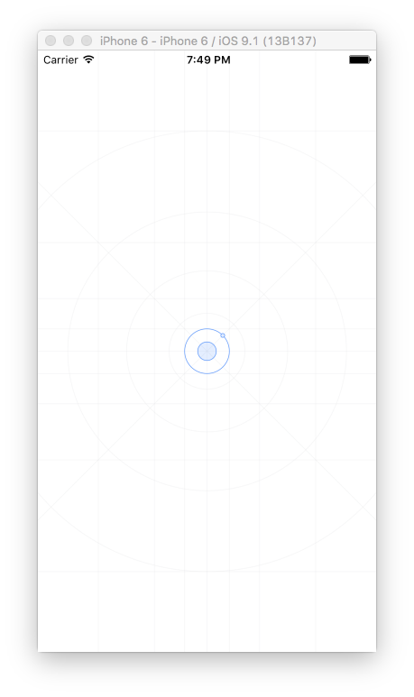

---
---

<header>
<h1>Create a mobile app</h1>
</header>

## Preview in the Studio

The mobile preview reloads automatically after any file changes occur:

## Run on a simulator

Click on Run and track the progress on the Studio console:

The simulator starts automatically and loads your app:

## Build your app binaries

Build your app and click on the link to open the generated files:

