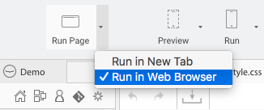

---
---

# Create a web app

## 1 - Run your web application in the Studio

Click on the Run Page toolbar button:

## 2 - Customize the panels

Open the right panel from the toolbar toggles:  

You can move the web preview on the right panel:

> **TIPS**: to open the preview in your default browser, open the Run Page dropdown:
> 

## 3 - Enable live reload

    
If you want the page to reload automatically after any file changes occur, please install <a target="_blank" href="https://nodejs.org/">node</a> and gulp:

    npm install -g gulp
    
Close the web preview panel and click again on Run Page. The Studio will install automatically the live-reload requierements:

## 4 - Code your Angular application

Wakanda integrates the Angular framework.

[Learn more »](http://wakanda.github.io/angular-wakanda/){:target="_blank"}{:class="btn"}

---

You can also create a mobile version of your application, based on the same backend.

[Create the mobile version »](create-mobile-app.html){:class="btn"}

