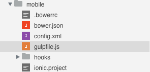
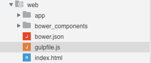
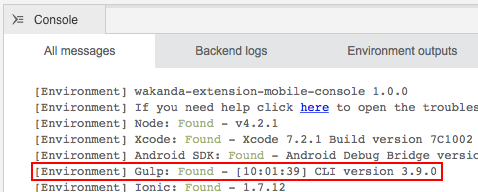
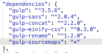
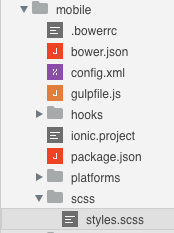
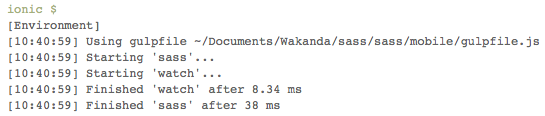
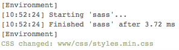

---
---

# Customize your build process

## Table of contents

- [Activating Gulp inside the Studio](#activating-gulp-inside-the-studio)
- [Customize the build process](#customize-the-build-process)
- [Add SASS precompiling](#add-sass-precompiling)
- [Additional functionalities](#additional-functionalities)
- [The same workflow for mobile and web](#the-same-workflow-for-mobile-and-web)

## Activating Gulp inside the Studio

[Gulp](http://gulpjs.com/) is a build tool built on [Node.js](https://nodejs.org/). It provide a Javascript interface to maintain complex build tasks easy and manageable.

You can find different `gulpfile.js` files inside a Wakanda project.

*mobile folder*



*web folder*



These are the entry points of the build process of your application.

Wakanda Studio is able to run the build tasks defined in the `gulpfile.js` files. In order to enable this functionality you should:

1. Install [Node.js](https://nodejs.org/)
2. Run in your Terminal:
  
  ```
  $ npm install --g gulp
  ```

3. Restart the Studio  

The console will inform you if Gulp is installed and correctly detected:



## Customize the build process

Gulp logic can be summarized by the concept of *tasks*. A `gulpfile.js` can include multiple tasks. When Gulp is launched, it collects all the tasks defined by the user and run the speficied ones.

`gulp serve` is the command invoked by the Studio when *Run Page* is clicked. Inside the `gulpfile.js` we can find the following line:

```javascript
gulp.task('serve', ['watch', 'connect']);
```

This is the first task run. The first parameter is the task name, 'serve', and the second parameter can be a function or an actions list. In your example we run different tasks:

- `connect`: launch a server ready to live-reload when a file changement message is received.
  
  ```javascript
  gulp.task('connect', function() {
    connect.server({
      root: ['.'],
      port: options.connectPort,
      livereload: {
        port: options.livereloadPort
      },
      middleware: function(conn, opt) {
        return [
          proxy('!/app/**', {
            target: options.serverUrl,
            changeOrigin: false,
            ws: true
          })
        ];
      }
    });
  });
  ```
  
- `watch` and `reload`: watch file changements in the specified folders and inform the live-reload server.
  
  ```javascript
  var baseFolder = options.app;
  gulp.task('watch', function() {
    gulp.watch([
      baseFolder + 'scripts/**/*.js',
      baseFolder + 'styles/**/*.css',
      baseFolder + 'views/**/*.html',
      baseFolder + 'index.html'
    ], ['reload']);
  });
  gulp.task('reload', function() {
    gulp.src(options.app + '**')
      .pipe(connect.reload());
  });
  ```

This is the code necessary for the live-reload to work. These tasks are normally different for each project:
- An appropriate folders and/or files list should be provided in the `watch` task.
- Root location, live-reload and proxy settings could be customized when necessary.


## Add SASS precompiling

We will now see how to add SASS files precompiling to the build process. First we need to add to our `package.json` the following dependency:

```javascript
"devDependencies": {
  "gulp-sass": "*"
}
```
 
First set a variable that stores the source and the destination folders in the `gulpfile.js`:

```javascript
var options = minimist(process.argv.slice(2), defaultOptions);
var baseFolder = options.app;
var paths = {
  sass: {
    src: [baseFolder + 'scss/**/*.scss'],
    dest: baseFolder + 'styles'
  }
};
```

Then import the `gulp-sass` dependency and create a Gulp task named `sass` with the following code:

```javascript
var sass = require('gulp-sass');

gulp.task('sass', function(done) {
  gulp.src(paths.sass.src) // define sources location
    .pipe(sass()) // start sass process
    .on('error', sass.logError) // halt on errors
    .pipe(gulp.dest(paths.sass.dest)) // copy css into destination
    .on('end', done); // quit
});
```

Finally enable the `watch` task to survey the files changements under the `app/scss` folder with `sass` and `reload` tasks as second parameter:

```javascript
gulp.task('watch', function() {
  gulp.watch(paths.sass.src, ['sass', 'reload']);
  gulp.watch([
  	baseFolder + 'scripts/**/*.js',
  	baseFolder + 'styles/**/*.css',
  	baseFolder + 'views/**/*.html',
   	baseFolder + 'index.html'
  ], ['reload']);
});
```

This way the Gulp `watch` task will now also trigger the `sass` sources precompiling and the live-reload event.

**NOTE:** If a Gulp process was already running you must close and re-open your solution to reload the configuration.

*BONUS: A little refractorization can make your life easier:*

```javascript
var paths = {
  sass: {
    src: [baseFolder + 'scss/**/*.scss'],
    dest: baseFolder + 'styles'
  },
  js: [baseFolder + 'scripts/**/*.js'],
  css: [baseFolder + 'styles/**/*.css'],
  html: [
    baseFolder + 'views/**/*.html',
    baseFolder + 'index.html'
  ]
};

gulp.task('watch', function() {
  gulp.watch(paths.sass.src, ['sass', 'reload']);
  gulp.watch([paths.js, paths.css, paths.html], ['reload']);
});
```

## Additional functionalities
A working `sass` task is now part of the build. We can improve it with additional functionalities:

### SASS options

SASS options can be set passing a parameter object to the `sass()` function:

```javascript
gulp.task('sass', function(done) {
  gulp.src(paths.sass.src)
    .pipe(sass({
      outputStyle: 'compressed' // produce compressed output
    }))
    .on('error', sass.logError)
    .pipe(gulp.dest(paths.sass.dest))    
    .on('end', done);
});
```

SASS compressed output helps to reduce the filesize.

### Minify and rename files

A complete minification can reduce the filesize even further:

```javascript
var minifyCss = require('gulp-minify-css'),
  rename = require('gulp-rename');
    
gulp.task('sass', function(done) {
  gulp.src(paths.sass.src)
    .pipe(sass())
    .on('error', sass.logError)
    .pipe(minifyCss()) // clean and minify *.css files
    .pipe(rename({ extname: '.min.css' })) // rename *.css to *.min.css
    .pipe(gulp.dest(paths.sass.dest))
    .on('end', done);
});
```

*Note: this functionality requires the following dependencies to be defined in the `package.json` file:

```javascript
"devDependencies": {
  "gulp-minify-css": "*",
  "gulp-rename": "*"
}
```

### Both compiled and minified versions

In order to produce  both a compiled and a minified version at the same time edit your `sass` task as follows:

```javascript
var minifyCss = require('gulp-minify-css'),
  rename = require('gulp-rename');
    
gulp.task('sass', function(done) {
  gulp.src(paths.sass.src)
    .pipe(sass())
    .on('error', sass.logError)
    .pipe(gulp.dest(paths.sass.dest)) // copy *.css to destination
    .pipe(minifyCss())
    .pipe(rename({ extname: '.min.css' }))
    .pipe(gulp.dest(paths.sass.dest)) // copy *.min.css to destination
    .on('end', done);
});
```

*Note: this functionality requires the following dependencies to be defined in the `package.json` file:

```javascript
"devDependencies": {
  "gulp-minify-css": "*",
  "gulp-rename": "*"
}
```

### Sourcemaps
In order to add sourcemaps edit your `sass` task as follows:
```javascript
var sourcemaps = require('gulp-sourcemaps');
gulp.task('sass', function(done) {
  gulp.src(paths.sass.src)
    .pipe(sourcemaps.init()) // generate sourcemaps
    .pipe(sass())
    .on('error', sass.logError)
    .pipe(sourcemaps.write()) // write sourcemaps into *.css
    .pipe(gulp.dest(paths.sass.dest))
    .on('end', done);
});
```

*Note: this functionality requires the following dependencies to be defined in the `package.json` file:

```javascript
"devDependencies": {
  "gulp-sourcemaps": "*"
}
```
You can now found your sourcemaps inside the output file as a comment:
```css
/*# sourceMappingURL=data:application/json;base64,eyJ2ZXJzaW9uIjo...
```

### Minify and rename, original and source maps

The combination of all:

```javascript
var sourcemaps = require('gulp-sourcemaps'),
  minifyCss = require('gulp-minify-css'),
  rename = require('gulp-rename');

gulp.task('sass', function(done) {
  gulp.src(paths.sass.src) // define sources location
    .pipe(sourcemaps.init()) // generate sourcemaps
    .pipe(sass()) // start sass process
    .on('error', sass.logError) // halt on errors
    .pipe(sourcemaps.write()) // write sourcemaps into *.css
    .pipe(gulp.dest(paths.sass.dest)) // copy *.css into destination
    .pipe(minifyCss()) // clean and minify *.css
    .pipe(rename({ extname: '.min.css' })) // rename *.css to *.min.css
    .pipe(sourcemaps.write()) // re-write sourcemaps into *.min.css
    .pipe(gulp.dest(paths.sass.dest)) // copy *.min.css to destination
    .on('end', done); // quit
});
```

*Note: this functionality requires the following dependencies to be defined in the `package.json` file:

```javascript
"devDependencies": {
  "gulp-minify-css": "*",
  "gulp-rename": "*",
  "gulp-sourcemaps": "*"
}
```

## The same workflow for mobile and web

We will now evaluate how to integrate the same workflow in our Wakanda Ionic-based mobile application. Inside the `mobile` folder you can find a `gulpfile.js` file. However this build process is slightly different:

- Ionic includes a live-reload mechanism for `www` folder. Thus a Gulp live-reload implementation is not necessary.
- Ionic already includes a snippet of code to support SASS precompilation.
- Ionic takes in consideration only the Gulp tasks defined in the `ionic.project` file.
- Node.js modules are not installed by default in the `mobile` folder.

In order:

1. Add to the `package.json` inside your `mobile` folder any Gulp dependency you may need. Following the example above we will need to add only `gulp-sourcemaps` to the dependencies already provided:
    
    
    
  
2. Run in the terminal `npm install` while inside your `mobile` folder to install all the Gulp and SASS dependencies defined in the `package.json` file.

3. Create a `scss` folder inside the `mobile` folder and put our sass sources inside:
  
     
  
    Being outside of the `www` folder, SASS sources won't included in the final application package.
  
4. Customize the `sass` task inside the `gulpfile.js` to be coherent with your project scaffolding:
  
  ```javascript
  var sourcemaps = require('gulp-sourcemaps'); // add missing require
  var paths = {
	sass: {
	  src: ['./scss/**/*.scss'],
	  dest: './www/css/'
    }
  };
  gulp.task('sass', function(done) {
     gulp.src(paths.sass.src)
       .pipe(sourcemaps.init())
	   .pipe(sass())
	   .on('error', sass.logError)
       .pipe(sourcemaps.write())
	   .pipe(minifyCss())
	   .pipe(rename({ extname: '.min.css' }))
	   .pipe(gulp.dest(paths.sass.dest))
       .on('end', done);
   });
   gulp.task('watch', function() {
     gulp.watch(paths.sass.src, ['sass']); // 'reload' task is not necessary
  });
  ```
  
5. Finally tell Ionic which Gulp tasks you want to run. Add this line inside the `ionic.project` file:
  
  ```javascript
  "gulpStartupTasks": ["sass", "watch"],
  ```
   
6. Now click on any mobile action button (for instance Preview). If the configuration is correct you should see the following output in the console:

  
    
  and when saving your sass sources:
    
  
       
**NOTE:** If a Ionic process was already running you must close and re-open your solution to reload the configuration.

## Other modules

Many additional Gulp modules are available. Here's a list of the more popular packages:

- [Less](https://www.npmjs.com/package/gulp-less)
- [Babel](https://www.npmjs.com/package/gulp-babel)
- [TypeScript](https://www.npmjs.com/package/gulp-typescript)
- [CoffeScript](https://www.npmjs.com/package/gulp-coffee)
- [Handlebars templates](https://www.npmjs.com/package/gulp-handlebars)
- [Mustache templates](https://www.npmjs.com/package/gulp-mustache)
- [JS Uglify](https://www.npmjs.com/package/gulp-uglify)
- [Imagemin](https://www.npmjs.com/package/gulp-imagemin)
